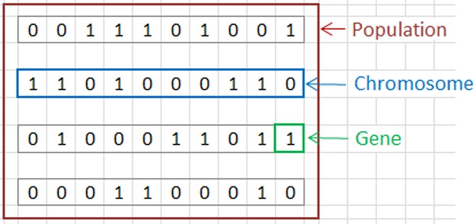
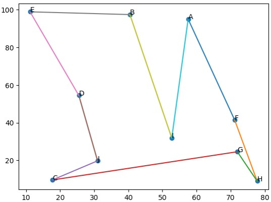

# 🧬Genetic Algorithms

_by John Holland 1970s_

## Characteristics:
 
 * Inspired by people's DNA structure.

 * Solutions represented by binary arrays

 </img>
 
 

##  Applications:

<h3 style="color:#00A3E7"><i><u>* Traveling Salesman Problem</u></i></h3>.
Calculate the path (without repeating nodes) that a salesperson must follow in order to minimize the distance by ending in the same start node .

 </img>

<h3 style="color:#00A3E7"><i><u>* 8 Queens</u></i></h3>.
