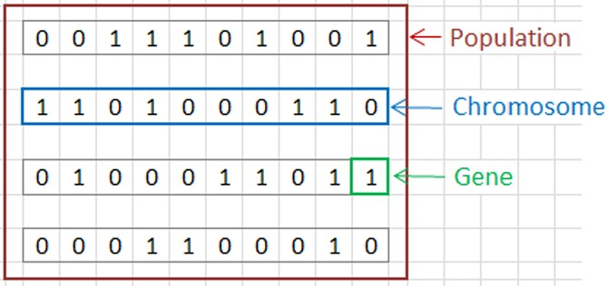
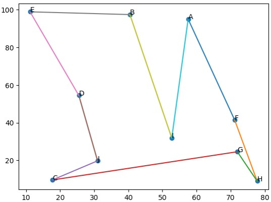
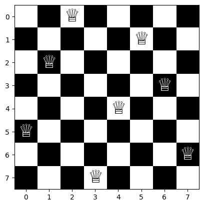
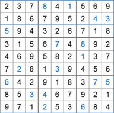
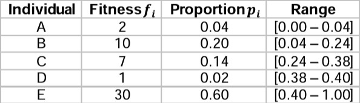
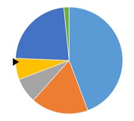
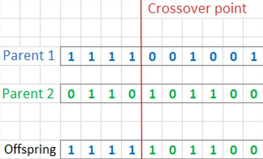
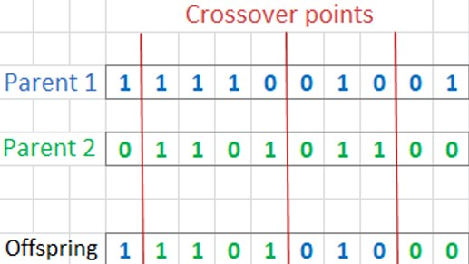

# 🧬Genetic Algorithms

_by John Holland 1970s_

## Characteristics
 ### • Inspired by people's DNA structure.
 ### • Solutions represented by binary arrays

     </img>

##  Applications
### <u> _[- Traveling Salesman](https://github.com/saracarolina12/IA_School/blob/master/Semestres/Optimizaci%C3%B3n%20y%20Metaheur%C3%ADsticas%20II/Code/Evolutionary%20Computation/Genetic%20Algorithms/TravelerSalesman/TravelerSalesman.ipynb)_ </u>
Calculate the path (without repeating nodes) that a salesperson must follow in order to minimize the distance by ending in the same start node . 

     </img>

### <u> _[- 8 Queens](https://github.com/saracarolina12/IA_School/blob/master/Semestres/Optimizaci%C3%B3n%20y%20Metaheur%C3%ADsticas%20II/Code/Evolutionary%20Computation/Genetic%20Algorithms/8Queens/8Queens.ipynb)_ </u>

     </img>

### <u> _[- Sudoku](https://www.researchgate.net/publication/311250094/figure/fig1/AS:550057118101504@1508155244101/A-Sudoku-with-17-clues-and-its-unique-solution.png)_ </u>

     </img>

##  Representations
The individuals' representation can be divided into **Genotype** (codified version of the solution) and **Phenotype** (the solution that represents an individual).

• **Binary representation:** Binary array. 

• **Integer representation:** Integer array. (for example, use this integers for directions [left, right, up, down]).

• **Real representation:** Real arrays [$x_1, x_2,...,x_n$] $where$ $x_i ∈ ℝ$

• **Permutation representation:** Permutation of a set.

 

## Selection of parents
• **Roulette Selection:** Each section is assigned to an individual.

$$
    p_i = \frac{f_i}{\sum_kf_k}
$$
where $p_i$ is the individual's proportion and $f_i$ its fitness.

Calcutate the range for each individual. Select an individual by choosing a random number between 0 and 1, if the number is between x range previously calculated, select it as a parent.

     </img>
     </img>

• **Tournament Selection:** Very well-known. Randomly select $k$ individuals and select the fittest one. $k = $ tournament size.

## Reproduction (crossover or recombination)
The goal is to generate new individuals (called offsprings) by combinating it's parent's properties.

### <u>*Binary and integer representation*</u>
* **1 point crossover**

     </img>

* **n point crossover**

     </img>

