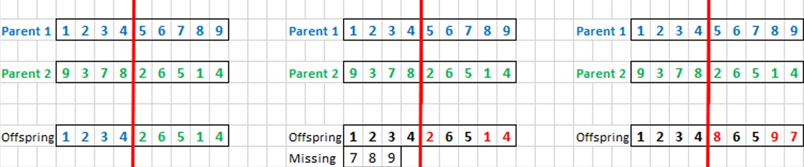
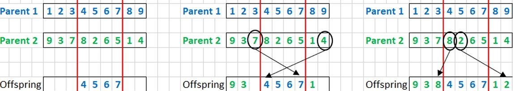

# 🧬Genetic Algorithms

_by John Holland 1970s_

## **Characteristics**
• Inspired by people's DNA structure.

• Solutions represented by binary arrays

     </img>

##  **Applications**

<table><tr><td>

         </img>

</td><td>

### <u> _[Traveling Salesman](https://github.com/saracarolina12/IA_School/blob/master/Semestres/Optimizaci%C3%B3n%20y%20Metaheur%C3%ADsticas%20II/Code/Evolutionary%20Computation/Genetic%20Algorithms/TravelerSalesman/TravelerSalesman.ipynb)_ </u>
Calculate the path (without repeating nodes) that a salesperson must follow in order to minimize the distance by ending in the same start node . 

</td><tr>

<tr><td>

         </img>

</td><td>

### <u> _[8 Queens](https://github.com/saracarolina12/IA_School/blob/master/Semestres/Optimizaci%C3%B3n%20y%20Metaheur%C3%ADsticas%20II/Code/Evolutionary%20Computation/Genetic%20Algorithms/8Queens/8Queens.ipynb)_ </u> 
Place 8 queens on the 8x8 board without letting them to attack each other in diagonal, up or down.

</td><tr>

<tr><td>

         </img>

</td><td>

### <u> _[Sudoku](https://www.researchgate.net/publication/311250094/figure/fig1/AS:550057118101504@1508155244101/A-Sudoku-with-17-clues-and-its-unique-solution.png)_ </u>
Must solve the traditional 9x9 sudoku.
</td><tr>

</table>

##  **Representations**
The individuals' representation can be divided into **Genotype** (codified version of the solution) and **Phenotype** (the solution that represents an individual).

<table>
    <tbody>
        <tr>
            <td rowspan=1>Binary</td>
            <td rowspan=1>Binary array (0,1)</td>
        </tr>
        <tr>
            <td rowspan=1>Integer</td>
            <td rowspan=1>Integer array. (for example, use this integers for directions left, right, up, down)</td>
        </tr>
        <tr>
            <td rowspan=1>Real</td>
            <td rowspan=1> Real arrays  [𝑥1,𝑥2,…,𝑥𝑛] where $x_i ∈ ℝ$ |</td>
        </tr>
         <tr>
            <td rowspan=1>Permutation</td>
            <td rowspan=1>Permutation of a set.</td>
        </tr>
    </tbody>
</table>

## **Selection of parents**
• **Roulette Selection:** Each section is assigned to an individual.

$$p_i = \frac{f_i}{\sum_kf_k}$$
where $p_i$ is the individual's proportion and $f_i$ its fitness.

Calcutate the range for each individual. Select an individual by choosing a random number between 0 and 1, if the number is between x range previously calculated, select it as a parent.

     </img>
     </img>

• **Tournament Selection:** Very well-known. Randomly select $k$ individuals and select the fittest one. $k =$ tournament size.

## **Reproduction (crossover or recombination)**
The goal is to generate new individuals (called offsprings) by combinating it's parent's properties.

### <u>*Binary and integer representation*</u>

<table>
    <tbody>
        <tr>
            <td rowspan=1>1 point crossover</td>
            <td rowspan=1>

</td>
        </tr>
        <tr>
            <td rowspan=1>Uniform crossover</td>
            <td rowspan=1>
Copy the gene of the first or the second parent randomly (uniform ditribution) 
</td>
        </tr>
        <tr>
            <td rowspan=1>n point crossover</td>
            <td rowspan=1>
 </img>
</td>
        </tr>
    </tbody>
</table>

### <u>*Real-valued representation*</u>
<table>
    <tbody>
        <tr>
            <td rowspan=1>Discrete reproduction</td>
            <td rowspan=1>Same idea as uniform crossover. Randomly copy the value of parent 1 or 2 and repeat this for each children.</td>
        </tr>
        <tr>
            <td rowspan=1>Asymmetric reproduction</td>
            <td rowspan=1> 𝑜=𝛼 𝑝1+(1−𝛼 𝑝2)  <i>where 0<= 𝛼 <=1</i></td>
        </tr>
    </tbody>
</table>

### <u>*Permutation representation*</u>
<table>
    <tbody>
        <tr>
            <td rowspan=1>Simple permutation crossover</td>
            <td rowspan=1>1. Divide the array in two parts and copy each section into offspring.
                          2. Calculate the duplicated and missing elements.
                          3. Randomly replace the repeated with the missing values.</td>
            <td rowspan=1>
 </img>
</td>
        </tr>
        <tr>
            <td rowspan=1>Partially mapped crossover:</td>
            <td rowspan=1>1. Divide the array in 3 parts and copy the intermediate section into offspring.
                      2. Copy the first and third section of de second parent except for those who already exist in offspring.
                      3. Add the missing values of the second part of the second parent that do not already appear in offspring.</i></td>
            <td rowspan=1>
 </img>
</td>
        </tr>
    </tbody>
</table>

## **Mutation**
_Consists on modifying the individuals in order to have more variants and check if these fit better._
<!-- * **Bitwise mutation:** Binary representation. Randomly select one or multiple genes and change its values. (0->1, 1->0)
* **Random resetting:** Integer representation. Randomly select one or multiple genes and reset its values.
* **Uniform mutation:** Real-valued representation. Randomly select one or multiple genes. Then, choose a random value between [min,max].
* **Swap mutation:** Permutation representation. Randomly select 2 elements and swap their values. -->

<table>
    <tbody>
        <tr>
            <td rowspan=1>Bitwise mutation</td>
            <td rowspan=1>Binary representation. Randomly select one or multiple genes and change its values. (0->1, 1->0)</td>
        </tr>
        <tr>
            <td rowspan=1>Random resetting</td>
            <td rowspan=1> Integer representation. Randomly select one or multiple genes and reset its values.</td>
        </tr>
        <tr>
            <td rowspan=1>Uniform mutation</td>
            <td rowspan=1>  Real-valued representation. Randomly select one or multiple genes. Then, choose a random value between [min,max].</td>
        </tr>
        <tr>
            <td rowspan=1>Swap mutation</td>
            <td rowspan=1> Permutation representation. Randomly select 2 elements and swap their values.</td>
        </tr>
    </tbody>
</table>

---

| Holland's original proposal of Genetic Arlgorithms        
| --------------------------------------------------------
| * **Representation:** binary
| * **Parents' selection:** roulette
| * **Crossover:** 1 point
| * **Mutation:** bitwise
| * **Population model:** generational

---

##### _by Sara Carolina_